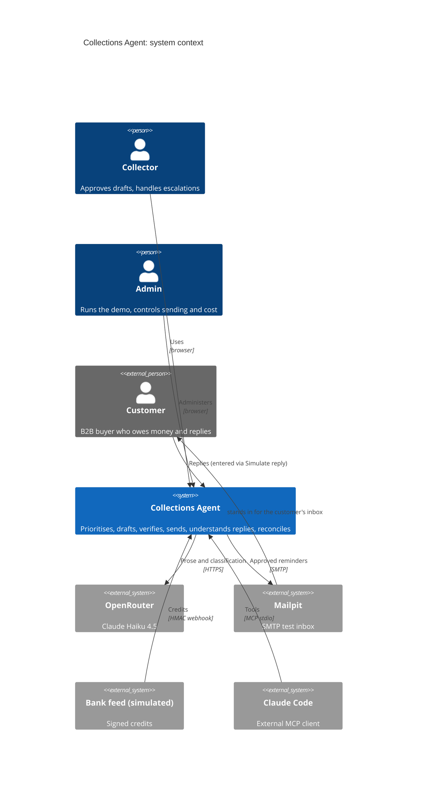
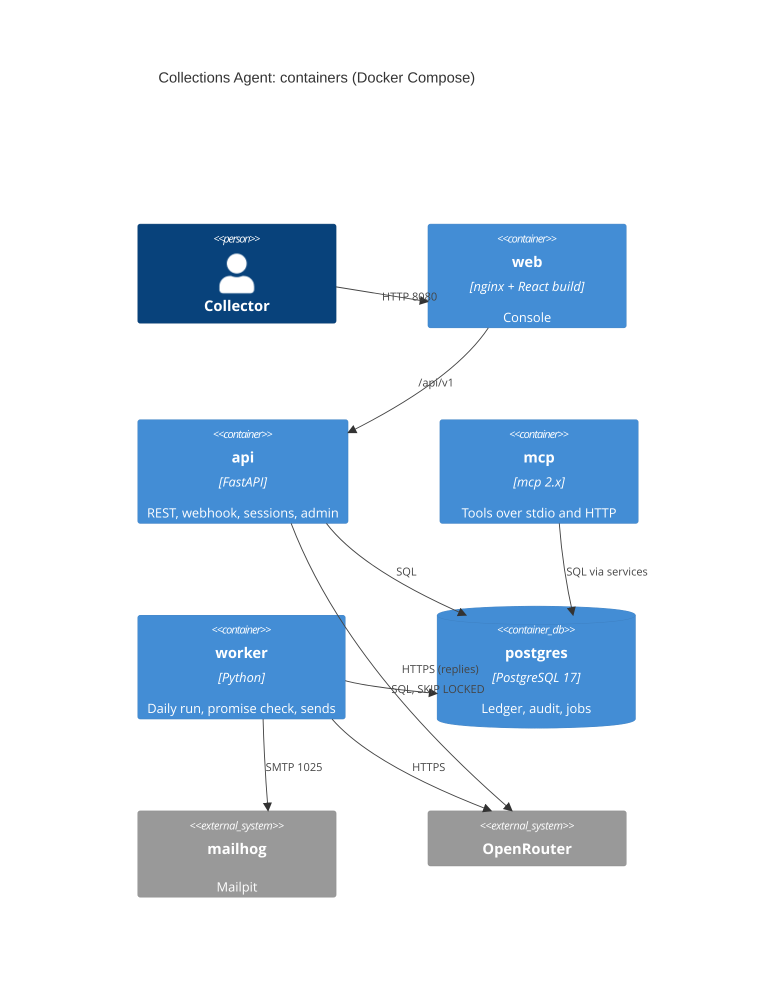

# C4: AI Receivables Collections Agent

Sources: docs/design/collections-hld.md, docs/architecture/architecture.json, api/openapi.yaml, ADR-0001 to ADR-0010. No code exists yet; every box is from the design, not the repository.

Drawn views: `docs/architecture/diagrams/CollectionsAgent_SystemArchitecture_v1.svg`, `_ArchitectureFlow_v1.svg`, `_DeploymentArchitecture_v1.svg` (render.py, diagram-check 0 problems).

## Context

## Containers

## Components (backend)

Orchestrator (4 roles, 4-call bound) → tool registry → services (ledger, drafting, guardrails, approval and send gate, payments, promises, disputes, escalations, timeline) → PostgreSQL; orchestrator → gateway → OpenRouter. See the system diagram's Core group.

## Sequences

The three flows (daily run to send, reply to promise or dispute, bank feed to promise fulfilled) are in HLD section 2.
