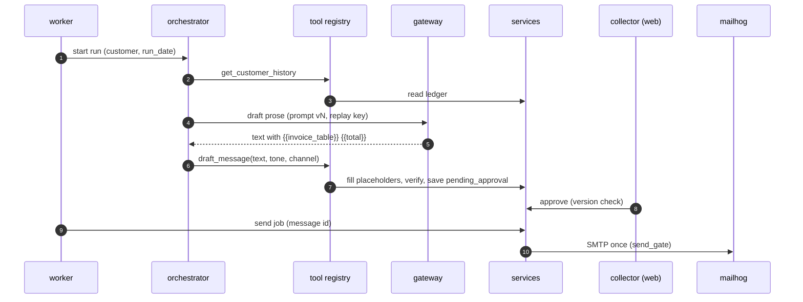
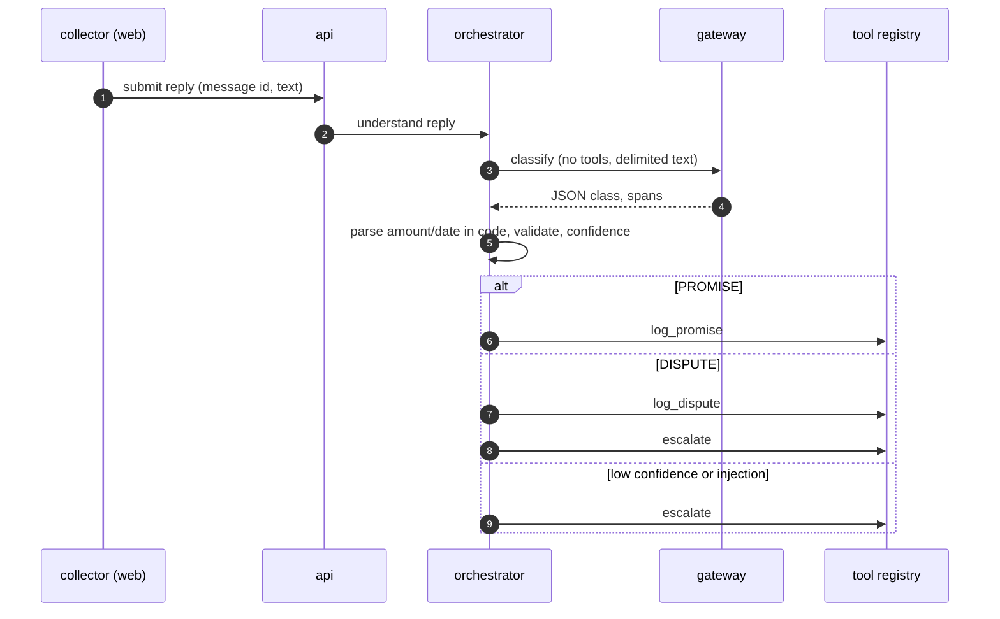
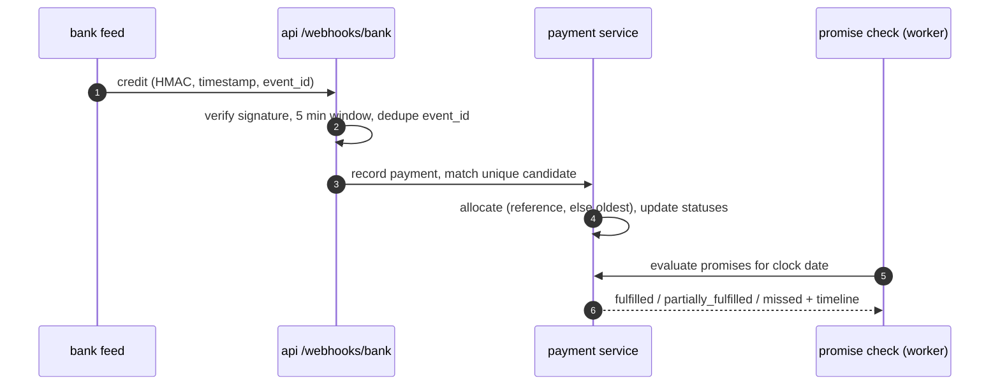
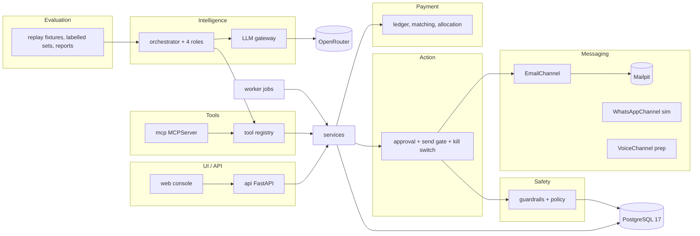

# High Level Design: AI Receivables Collections Agent

- Task: HACK-001
- Author, date: Savitha Sista with Claude Code, 2026-09-30
- Status: Reviewed
- PRD: docs/product/PRD.md (REQ-001 to REQ-120); backlog docs/product/backlog.md (US-00-001 to US-03-004)
- ADRs: docs/architecture/decisions.md (ADR-0001 to ADR-0011)
- Tenets: docs/architecture/tenets.md

Serves: REQ-001 to REQ-120; objectives B1 to B5; all 46 stories; ADR-0001 to ADR-0011.

## Summary

One Python backend package (FastAPI api, MCP server, job worker) over one PostgreSQL 17 ledger, with a React console served as static files, runs as six Docker Compose services on one machine. The model only writes prose and classifies replies through one replayable gateway; every number, priority, tone, match and send decision is deterministic code behind a single service layer, and every send passes a human approval gate.

Diagram: docs/architecture/diagrams/CollectionsAgent_SystemArchitecture_v1.svg

## What gets built

| Component | Kind | Stack | Responsibility | Repository |
| --- | --- | --- | --- | --- |
| api | backend | Python 3.12, FastAPI, SQLAlchemy 2, Pydantic v2 | REST API for the console, bank webhook, auth sessions, admin | CollectionsAgentPlatform |
| mcp | backend | Python 3.12, mcp 2.x MCPServer | Tool registry over stdio (Claude Code) and streamable HTTP | CollectionsAgentPlatform |
| worker | worker | Python 3.12, Postgres job table (SKIP LOCKED) | daily run, promise check, send queue | CollectionsAgentPlatform |
| web | frontend | React 19, Vite, TanStack Query, Tailwind, nginx | collector, admin and viewer console | CollectionsAgentPlatform |
| postgres | data | PostgreSQL 17 (postgres:17-alpine) | the ledger and every audit record | none (stock image) |
| mailhog | infrastructure | Mailpit v1.31 | SMTP test inbox on 1025, UI on 8025 | none (stock image) |

## 1. Goal and non-goals

Goal: a collector at an Indian B2B company opens one console and sees who to chase today and why, approves reminders whose every invoice, amount, total, name and date is proven against the ledger, and watches replies turn into promises, disputes and matched payments without typing them. The system is an "AI employee" whose judgement calls (who, when, what tone, what was paid) are deterministic and auditable, and whose language work (prose, reading replies) is bounded, measured and replayable. It must run end to end from a clean checkout with Docker alone and pass its checks with no network.

Section 1 was not put to the engineer for a separate "agree?" step: the master prompt allows one pause (Phase 3), and these goals restate PRD objectives B1 to B5.

Non-goals:
- Real WhatsApp, telephony, payment gateway or bank connection (PRD non-goals; simulated adapters only).
- Import from Tally or other accounting systems (Q-017, D-002).
- Real inbound email for replies (Q-007, D-001).
- Multi-tenancy, SSO, regional-language drafts (Q-014, Q-018).
- A hosted production deployment (ADR-0010).

## 2. Users and flows

Actors: Collector, Admin, Viewer (browser); Customer (email reply, simulated); Bank feed (signed webhook, simulated); MCP client (Claude Code).

Flow A: daily run to sent reminder (US-01-001, US-00-005 to US-00-011)
1. Worker (09:00 IST on the demo date, or Admin presses Run now) creates one AgentRun per top-15 customer from the priority service.
2. Code computes the tone (gentle, firm, final) and the channel (email unless WhatsApp is enabled and preferred) before the model is called; the model cannot change either.
3. The Collections role runs a bounded tool-use loop: each gateway call returns either one tool call from the role's allow-list (`get_customer_history`, `get_invoice`, `check_promise_status`, `draft_message`, `escalate`) or a final answer. The registry wrapper counts executed tool calls; a model request for a fifth call is not executed and the run ends `STOPPED_LIMIT` (AC-US-01-001-4). Typical path: history, draft (2 tool calls, 3 model turns).
4. `draft_message` receives prose with `{{invoice_table}}` and `{{total}}`; the drafting service fills them from the ledger; guardrails verify the final text; the message becomes `pending_approval` or is rejected with a GuardrailEvent.
5. Collector reviews the draft with its guardrail report and trajectory, approves (or edits, which re-verifies).
6. Worker sends through the email channel to Mailpit once; status `sent`; timeline written at every step.

Flow B: reply to promise or dispute (US-03-001, US-00-012 to US-00-016)
1. Collector (or a script) submits the customer's reply against the sent message.
2. Reply Understanding role classifies with no tools; code parses amount and date against the demo clock and validates.
3. Code maps the validated class to a fixed tool sequence (the model does not pick tools while reading untrusted text):

| Class | Tool sequence (count) | Outcome |
| --- | --- | --- |
| PROMISE | `log_promise` (1) | WAIT_FOR_APPROVAL if a confirmation is drafted, else NO_ACTION |
| PART_PAYMENT | `check_promise_status`, `create_followup` (2); payment itself only via ledger | NO_ACTION |
| DISPUTE | `log_dispute`, `escalate`, `draft_message` (fixed acknowledgement) (3) | ESCALATED |
| STATEMENT_REQUEST | `draft_message` (statement) (1) | WAIT_FOR_APPROVAL |
| PAYMENT_CONFIRMATION | Payment Verification role: ledger match; on no match `escalate` (1) | NO_ACTION or ESCALATED |
| NO_INTENT_UNCLEAR, OTHER_NOISE | none, or `escalate` when confidence is low (0 or 1) | NO_ACTION or ESCALATED |
| any class below `CLASSIFY_MIN_CONFIDENCE`, or injection suspected | `escalate` (1) | ESCALATED |

Every sequence is at most 3 tool calls, inside the bound of 4.

Flow C: bank feed to promise fulfilled (US-01-004, US-00-017, US-00-019, US-00-020)
1. Admin advances the clock to 05 Oct; the promise check runs and marks `missed` or `partially_fulfilled` only promises whose date is before the new today (ABC's 05 Oct promise stays pending).
2. Bank feed posts a signed credit (the admin "simulate credit" button calls an api endpoint that builds and signs the event server-side with `BANK_WEBHOOK_SECRET` and passes it through the same handler). The handler checks the signature and a 5-minute window on the webhook's wall-clock timestamp, dedupes `event_id`, and stores the payment with `received_on = clock.today()`.
3. In the same transaction the payment service matches the unique candidate, allocates (referenced invoice first, else oldest), updates statuses, and re-evaluates that customer's pending promises: ABC's promise becomes `fulfilled`. The timeline shows each step.

## 3. Architecture

Layers (from the brief, section 5), each calling only the layer the table allows:

- **api** (Backend app): FastAPI routes for the console, `/webhooks/bank`, session auth, admin; thin adapters over services (tenet 3). Talks to Postgres through services.
- **mcp** (Backend app): `MCPServer` exposing the registry over stdio and streamable HTTP with bearer `MCP_TOKEN` (ADR-0004).
- **tool registry** (Backend module): one Pydantic input and output model and one typed error envelope per tool; calls services; used in-process by the orchestrator (ADR-0005).
- **orchestrator** (Backend module): per-customer loop, 4-call budget counted in its registry wrapper, roles Collections, Reply Understanding, Payment Verification, Escalation; no agent-to-agent calls.
- **gateway** (Backend module): the only OpenRouter caller; caps, retries, timeouts, cost, budget, live/replay/record (ADR-0007).
- **services** (Backend module): the only writers; each state change writes its TimelineEvent and any GuardrailEvent in the same transaction.
- **guardrails** (Backend module): deterministic checks and `policy/guardrails.yaml`; read-only on the ledger.
- **worker** (Backend app): polls `jobs` with SKIP LOCKED; daily run, promise check, sends (ADR-0006). An in-worker scheduler enqueues `daily_run` for the demo date at 09:00 IST (idempotent on `(kind, dedupe_key)`); the clock-advance endpoint enqueues `promise_check`.
- **web** (Console app): React SPA; generated types from `api/openapi.yaml`; formats INR and dates at the edge only.

**Risks this leaves open**
- The in-process registry and the MCP-served registry could diverge if someone adds a tool path that bypasses the registry wrapper; mitigated by tenet 3 and a test that the MCP tool list equals the registry list.
- One backend image means one bad dependency breaks api, mcp and worker together.

## 4. Data

Entities (brief 4.2): Customer, Invoice, Payment, PaymentAllocation, Promise (+ promise_invoices), Dispute, Message (with version), Reply, Escalation, TimelineEvent, AgentRun, AgentStep, GuardrailEvent, LlmCall, Settings, Job, User, Session. Store: one PostgreSQL 17 database. Money BIGINT paise. Balances from the `invoice_balances` view; invoice `status` is a column written only by the allocation and dispute services. Reset: `make reset-demo` and the admin button reseed every table except `users`, `sessions` and `llm_calls`, so the LLM budget keeps counting across rehearsals (AC-US-01-005-1 amended). Retention: demo data is reset on demand; no deletion policy beyond reset (privacy-review sets one for real use). Migrations: Alembic, each with a tested downgrade; the full model is in `docs/design/data-model.md` (`data-model`, this phase).

**Risks this leaves open**
- Status column and view can disagree if a future writer bypasses the allocation service; a consistency test runs after seed and after the story.
- Timeline and trajectory tables grow with every run; fine for a demo, needs retention for real use.

## 5. Interfaces

- REST API: `api/openapi.yaml` (`openapi-spec`, this phase): customers, invoices, priorities, runs, messages (approve, edit, reject), replies, promises, disputes, escalations, timeline, dashboard, evals, admin (settings, clock, reset), auth.
- Webhook: `POST /webhooks/bank`, HMAC-SHA256 over timestamp and body with `BANK_WEBHOOK_SECRET`, 5-minute window, unique `event_id`.
- MCP tools: schemas in the registry, listed in the LLD (7 required, 6 additional).
- SMTP: plain SMTP to `SMTP_HOST:SMTP_PORT` (Mailpit 1025).
- Internal: `jobs` table rows (kind, key, payload, status, attempts, run_at).

## 6. External integrations

| Integration | On the runtime path for | When down, slow or rate limited | Credential |
| --- | --- | --- | --- |
| OpenRouter (Claude Haiku 4.5) | drafting prose, classifying replies | retries 3 with backoff, then the customer is skipped with LLM_UPSTREAM and shown in admin; operators switch `LLM_MODE=replay` (runbook) | `OPENROUTER_API_KEY` in `.env`, never committed |
| Mailpit (local container) | email send | send job fails, message `failed`, retried after recovery | none |
| Bank feed (simulated, local script or admin button) | payments | nothing arrives; promises go missed on schedule, which is correct behaviour | `BANK_WEBHOOK_SECRET` |

### Deliberately not integrated

- Real bank or UPI feeds: out of scope; the webhook contract is the seam (PRD non-goal).
- WhatsApp Business API: the channel is simulated behind the same interface (REQ-060).
- Telephony: Prepare Call only (REQ-061).
- Accounting systems (Tally, Zoho): D-002.

**Risks this leaves open**
- OpenRouter latency on stage is outside our control; the demo defaults to replay (CEO review R2).

## 7. Failure modes

| Component | What fails | How it is noticed | What the user sees | How it recovers |
| --- | --- | --- | --- | --- |
| gateway | OpenRouter down or 429 | LLM_UPSTREAM in logs, run step failed | customer skipped; admin shows the error | retry next run, or switch to replay |
| gateway | budget exhausted | BUDGET_EXHAUSTED GuardrailEvent | admin banner; no new drafts | admin raises `LLM_BUDGET_USD` or uses replay |
| gateway (replay) | fixture missing | REPLAY_MISS with the key | run step failed with key | `make record-fixtures` in record mode |
| guardrails | draft mismatch or unsafe tone | GuardrailEvent | draft rejected with the reason | next run redrafts |
| worker | send to Mailpit fails with an error | job attempts, `last_error` code | status failed after the limit, timeline entry | retried with backoff while each failure was definite |
| worker | worker dies after SMTP accepted but before `sent` committed | reaper finds `last_error = IN_FLIGHT` on a stale lock | message `failed` with UNCONFIRMED: "Delivery unconfirmed, check the inbox before resending" | never auto-retried (at most once, REQ-062); a collector resends by hand |
| send gate | kill switch on or not approved | SENDING_DISABLED / NOT_APPROVED | "Sending is paused" banner | admin turns sending on |
| api webhook | duplicate or stale or unsigned event | 200 no-op / 401 | nothing changes | sender retries correctly |
| orchestrator | fifth tool call requested | STOPPED_LIMIT outcome | outcome badge in trajectory | none needed |
| postgres | not ready or down | `/readyz` 503 | console error state with retry | compose healthcheck, restart |
| web | api unreachable | fetch error | error state with retry per panel | api restart |

## 8. Scaling and limits

Expected load: 50 customers, 300 invoices, one daily run over 15 customers, a handful of collectors. Model calls per run: typically 3 per customer (45 per run), worst case 5 (4 tool calls plus a final turn; 75 per run); at about 2,000 input and 200 output tokens per turn that is about $0.003 per turn, so a worst-case run costs about $0.23. Worst window: a live demo where the run, three browser tabs and the webhook fire within one minute; still under 5 requests per second. First bottleneck: OpenRouter latency (assumption: 1 to 3 s per call; 45 to 75 calls sequentially is 1 to 4 minutes live). One Postgres and one worker are enough at this size; no replica or second worker is planned. The design stops working as-is around several thousand customers per run (sequential calls exceed a daily window) or about 50 jobs per second (polling queue); neither is in scope. The budget is shared by runs and evals in the same database: `make eval` in live mode spends from the same `LLM_BUDGET_USD`, so CI and rehearsals use replay.

**Risks this leaves open**
- A live-mode rehearsal plus a live eval on the same day can exhaust the $2.00 default budget (about 660 turns at $0.003).
- The budget check is a reservation: under a Postgres advisory lock the gateway inserts a pending `llm_calls` row priced at the worst case (`max_tokens`), then calls, then writes the actual cost; concurrent runs and evals cannot overshoot.

## 9. Security and privacy

- Auth: server-side sessions for three seeded users; `ADMIN_TOKEN` for scripts; bearer `MCP_TOKEN` on MCP HTTP; stdio MCP trusts the local user (ADR-0009, ADR-0004).
- Authorisation: role matrix per endpoint (viewer read-only; collector approves, edits, rejects, simulates replies; admin settings, clock, reset, runs). MCP callers act with the collector role and the timeline actor `ai` (source `mcp`); no MCP tool reaches admin actions. A test calls every endpoint and every tool as every role.
- Runtime settings: `SENDING_ENABLED`, `AUTONOMY_MODE`, `LLM_BUDGET_USD` and the `FEATURE_*` variables only seed the `settings` row on migrate and reset; `send_gate`, feature checks and the gateway read the row on every call, so admin changes apply at once in api, mcp and worker.
- Trust boundaries: customer reply text and webhook bodies are untrusted. Replies are classified with no tools, delimited, and parsed in code; webhooks are HMAC-verified with a replay window.
- PII: customer names, emails, phones, reply bodies. Logs carry ids, never bodies or addresses; trajectory arguments are redacted (REQ-036, REQ-113). Seed data uses `example.in` domains only.
- Secrets: `OPENROUTER_API_KEY`, `BANK_WEBHOOK_SECRET`, `MCP_TOKEN`, `SESSION_SECRET`, `ADMIN_TOKEN` in `.env` only; gitleaks in pre-commit.

**Risks this leaves open**
- Prompt injection that stays inside the allowed classes (a reply that fakes a plausible promise) cannot be detected by rules; low-confidence routing and human review are the backstop. The threat model rates it.
- The repository is public; nothing secret may land in fixtures or recorded replay files.

## 10. Observability

Structured JSON logs with request id and, inside a run, run id and customer id; no bodies. Admin view: runs with outcomes, LLM spend against budget, guardrail failures, job queue. `/healthz` and `/readyz` on api. No metrics stack or dashboards (hackathon depth); runbook `docs/runbooks/demo-day.md` covers LLM down, budget, Mailpit down, kill switch, reset.

**Risks this leaves open**
- Without metrics, a slow degradation (rising LLM latency) is only visible in logs and the admin run list.

## 11. Analytics

Product analytics are out of scope. The business questions the brief asks (outstanding, overdue, ageing, promises kept, disputes, cost per run, eval accuracy) are answered by SQL over the domain tables on the dashboard, admin and evaluation pages. The audit trail (timeline, trajectory, guardrail events) is kept apart from any analytics.

**Risks this leaves open**
- No usage events: we cannot tell which screens collectors use; acceptable for a demo.

## 12. Rollout and rollback

Phases: P0 build (including ADR-0011's payment beats), then P1, then P2 behind `FEATURE_WHATSAPP`, `FEATURE_VOICE`, `FEATURE_PAYMENT_LINK` and a Trusted-mode flag, all default off. Migrations run forward with `make migrate`; each has a tested downgrade. Rollback (images are built locally, so there is no previous tag to pull): check out the previous commit, run `make migrate-down` to its revision, rebuild with `docker compose build`, then `make reset-demo`. Work in flight at cutover: queued jobs are rows and survive a restart; a send job in progress when the worker stops is retried by its message-id key (at most once delivered); a draft pending approval stays pending across versions because the message schema only grows.

**Risks this leaves open**
- A downgrade migration after real sends would lose rows added by the newer schema; acceptable for demo data, not for real use.

## 13. Outside the standard stack

| Technology | ADR | Sign-off |
| --- | --- | --- |
| mcp 2.x (Python MCP SDK) | ADR-0004 | needs Architect or Engineering Manager sign-off |
| OpenRouter (model routing) | ADR-0007 | needs Architect or Engineering Manager sign-off |
| Mailpit | ADR-0008 | needs Architect or Engineering Manager sign-off |
| Postgres job queue instead of a broker | ADR-0006 | needs Architect or Engineering Manager sign-off |

## 14. Repository plan

| Repository | Git path | Stack | Apps |
| --- | --- | --- | --- |
| CollectionsAgentPlatform | CollectionsAgent/Server/CollectionsAgentPlatform (codedbygo/receivables-agent) | python-api | backend (api, mcp, worker), web (console) |

## 15. Decisions and conflicts

11 ADRs, all Accepted; 4 conflicts settled (docs/architecture/decisions.md). ADRs needed: none open.

## 16. What the review found

Reviewed by: critic, 2026-09-30

### MAJOR: STOPPED_LIMIT cannot happen under a deterministic orchestrator
Claim: the orchestrator picks everything in code, so no model output can request a fifth tool call; "60 model calls" counted tool calls.
Conflicts with: AC-US-01-001-4, REQ-032, eng review P2.
Fix: the Collections role is a bounded model tool-use loop over an allow-list; tone and channel stay in code; section 8 recomputed (3 to 5 turns per customer).
Status: fixed (sections 2 Flow A, 8)

### MAJOR: "at most once delivered" has no mechanism
Claim: a send retried by its message-id key after a crash is delivered at most once.
Conflicts with: REQ-062, AC-US-00-011-2, AC-US-00-011-3, AC-US-00-011-4.
Fix: commit a claim (`last_error = IN_FLIGHT`, attempts + 1) before SMTP; a crash leaves it UNCONFIRMED and it is never auto-retried; no seventh status needed.
Status: fixed (section 7; data model `messages.last_error`)

### MAJOR: payment date and promise evaluation order are undefined in Flow C
Claim: the promise check on clock advance fulfils the promise, but the credit arrives after it.
Conflicts with: tenet 5, Q-004, AC-US-00-020-1, REQ-110.
Fix: `received_on = clock.today()`; the payment transaction re-evaluates that customer's pending promises; the scheduled check only settles past dates.
Status: fixed (section 2 Flow C; data model `payments.received_on`)

### MINOR: reset-demo may also reset the LLM budget
Claim: demo data is reset on demand.
Conflicts with: AC-US-01-005-1, REQ-096.
Fix: reset keeps `users`, `sessions`, `llm_calls`; AC-US-01-005-1 amended.
Status: fixed (section 4; backlog)

### MINOR: settings changed at runtime are still env vars
Claim: feature flags and kill switch named as env vars.
Conflicts with: REQ-092, REQ-017, AC-US-01-006-1.
Fix: env seeds the `settings` row; runtime reads the row; conflict added to docs/architecture/decisions.md; feature columns added to `settings`.
Status: fixed (section 9; decisions.md; data model)

### MINOR: Flow B has no branch for three reply classes
Claim: Flow B branches only on PROMISE, DISPUTE and low confidence.
Conflicts with: US-00-015, US-00-018, REQ-064, AC-US-00-016-4.
Fix: class-to-tool-sequence table with counts (all 3 or fewer).
Status: fixed (section 2 Flow B)

### MINOR: rollback names artifacts that do not exist
Claim: "previous image tag".
Conflicts with: ADR-0010, eng review (images built locally).
Fix: previous commit, downgrade, rebuild, reset.
Status: fixed (section 12)

### MINOR: MCP callers bypass the role matrix
Claim: MCP bearer token holders can call writing tools with no role.
Conflicts with: REQ-111, AC-US-00-018-3.
Fix: MCP acts as collector with actor `ai`; matrix test covers tools.
Status: fixed (section 9)

Not said, now said: the 09:00 scheduler (section 3), fixture invalidation on seed change (section 17), who signs simulated bank credits (Flow C), budget race (section 8), single Postgres and worker (section 8).

## 17. Open questions and assumptions

| Item | Owner | Date |
| --- | --- | --- |
| Hackathon deadline (estimate fit check) | Savitha Sista | open |
| 16 PRD assumptions under "Needs your confirmation" (docs/product/questions.md) | Savitha Sista | open |
| assumption: OpenRouter call latency 1 to 3 s for 500 output tokens (not measured; spike made no completion call) | Claude Code | measure in the gateway task |
| Replay fixtures hash normalised input that includes ledger data, so a seed or prompt change invalidates them and re-recording needs a live key. Mitigation: the fixture manifest stores the seed hash and prompt versions; a test fails fast with "fixtures recorded for seed X, prompts Y" when they differ. | Claude Code | gateway task |
