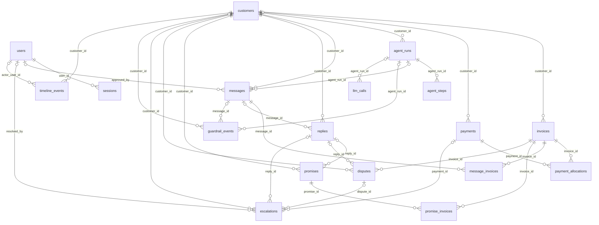

# ERD: AI Receivables Collections Agent

## Relationships

- `sessions.user_id` references `users`: exactly one users row per sessions row, many sessions rows per users row; on delete cascade. Who is signed in.
- `invoices.customer_id` references `customers`: exactly one customers row per invoices row, many invoices rows per customers row; on delete restrict. Who owes it.
- `payments.customer_id` references `customers`: zero or one customers row per payments row, many payments rows per customers row; on delete restrict. Matched customer; null while it needs human verification.
- `payment_allocations.payment_id` references `payments`: exactly one payments row per payment_allocations row, many payment_allocations rows per payments row; on delete cascade. The payment being applied.
- `payment_allocations.invoice_id` references `invoices`: exactly one invoices row per payment_allocations row, many payment_allocations rows per invoices row; on delete restrict. The invoice it pays.
- `agent_runs.customer_id` references `customers`: exactly one customers row per agent_runs row, many agent_runs rows per customers row; on delete restrict. The customer the run is about.
- `agent_steps.agent_run_id` references `agent_runs`: exactly one agent_runs row per agent_steps row, many agent_steps rows per agent_runs row; on delete cascade. The run.
- `messages.customer_id` references `customers`: exactly one customers row per messages row, many messages rows per customers row; on delete restrict. Recipient customer.
- `messages.agent_run_id` references `agent_runs`: zero or one agent_runs row per messages row, many messages rows per agent_runs row; on delete set null. Run that drafted it; null for statement drafts from the UI.
- `messages.approved_by` references `users`: zero or one users row per messages row, many messages rows per users row; on delete restrict. Who approved.
- `message_invoices.message_id` references `messages`: exactly one messages row per message_invoices row, many message_invoices rows per messages row; on delete cascade. The message.
- `message_invoices.invoice_id` references `invoices`: exactly one invoices row per message_invoices row, many message_invoices rows per invoices row; on delete restrict. A cited invoice.
- `replies.customer_id` references `customers`: exactly one customers row per replies row, many replies rows per customers row; on delete restrict. Who replied.
- `replies.message_id` references `messages`: zero or one messages row per replies row, many replies rows per messages row; on delete set null. Message it answers; null for seeded history.
- `promises.customer_id` references `customers`: exactly one customers row per promises row, many promises rows per customers row; on delete restrict. Who promised.
- `promises.reply_id` references `replies`: zero or one replies row per promises row, many promises rows per replies row; on delete set null. Reply it came from; null for seeded history.
- `promise_invoices.promise_id` references `promises`: exactly one promises row per promise_invoices row, many promise_invoices rows per promises row; on delete cascade. The promise.
- `promise_invoices.invoice_id` references `invoices`: exactly one invoices row per promise_invoices row, many promise_invoices rows per invoices row; on delete restrict. A covered invoice.
- `disputes.customer_id` references `customers`: exactly one customers row per disputes row, many disputes rows per customers row; on delete restrict. Who disputes.
- `disputes.invoice_id` references `invoices`: exactly one invoices row per disputes row, many disputes rows per invoices row; on delete restrict. The invoice disputed.
- `disputes.reply_id` references `replies`: zero or one replies row per disputes row, many disputes rows per replies row; on delete set null. Reply that raised it.
- `escalations.customer_id` references `customers`: exactly one customers row per escalations row, many escalations rows per customers row; on delete restrict. Customer concerned.
- `escalations.dispute_id` references `disputes`: zero or one disputes row per escalations row, many escalations rows per disputes row; on delete set null. Source dispute.
- `escalations.reply_id` references `replies`: zero or one replies row per escalations row, many escalations rows per replies row; on delete set null. Source reply.
- `escalations.payment_id` references `payments`: zero or one payments row per escalations row, many escalations rows per payments row; on delete set null. Source payment.
- `escalations.resolved_by` references `users`: zero or one users row per escalations row, many escalations rows per users row; on delete restrict. Who closed it.
- `guardrail_events.customer_id` references `customers`: zero or one customers row per guardrail_events row, many guardrail_events rows per customers row; on delete set null. Customer concerned, if any.
- `guardrail_events.message_id` references `messages`: zero or one messages row per guardrail_events row, many guardrail_events rows per messages row; on delete set null. Message concerned, if any.
- `guardrail_events.agent_run_id` references `agent_runs`: zero or one agent_runs row per guardrail_events row, many guardrail_events rows per agent_runs row; on delete set null. Run concerned, if any.
- `llm_calls.agent_run_id` references `agent_runs`: zero or one agent_runs row per llm_calls row, many llm_calls rows per agent_runs row; on delete set null. Run that made the call; null for evals.
- `timeline_events.customer_id` references `customers`: exactly one customers row per timeline_events row, many timeline_events rows per customers row; on delete cascade. Whose timeline.
- `timeline_events.actor_user_id` references `users`: zero or one users row per timeline_events row, many timeline_events rows per users row; on delete set null. Human actor.
