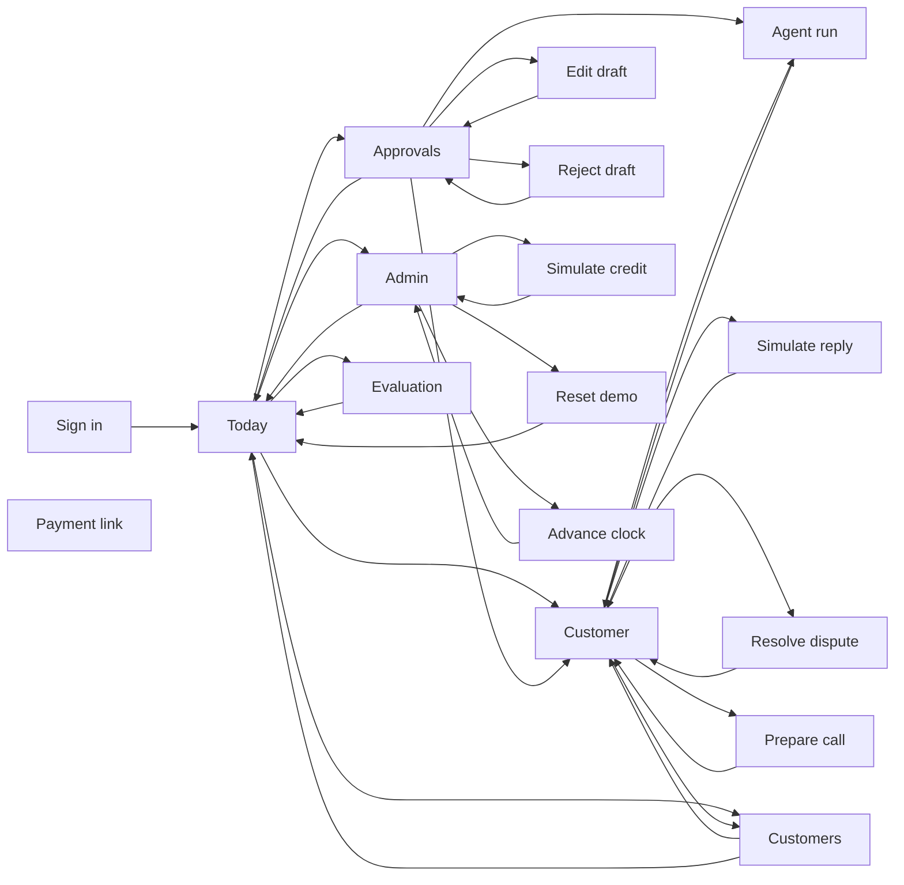
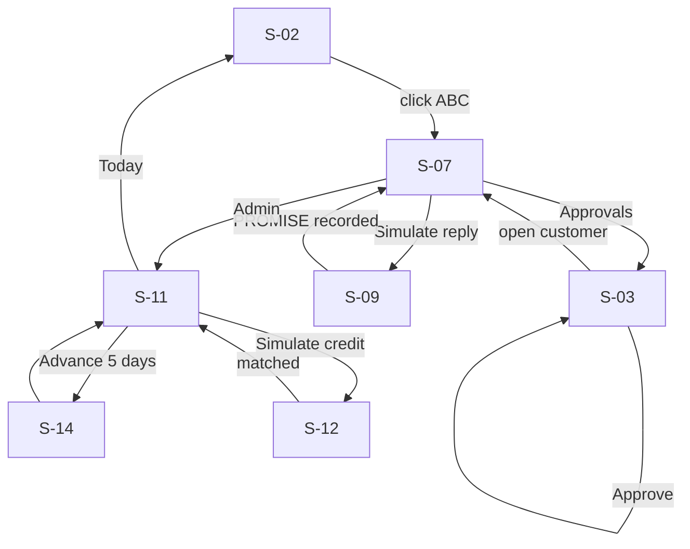
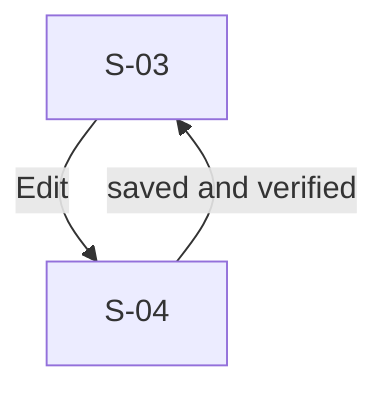
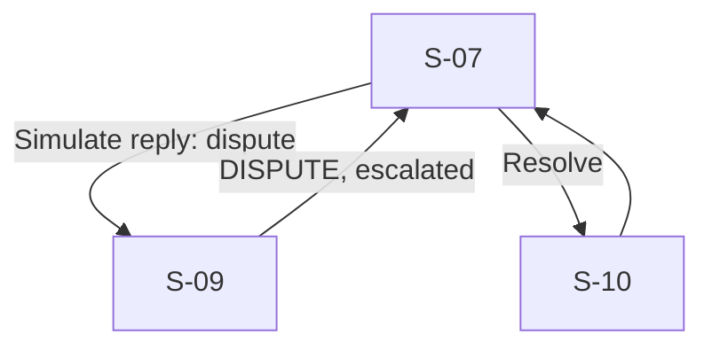
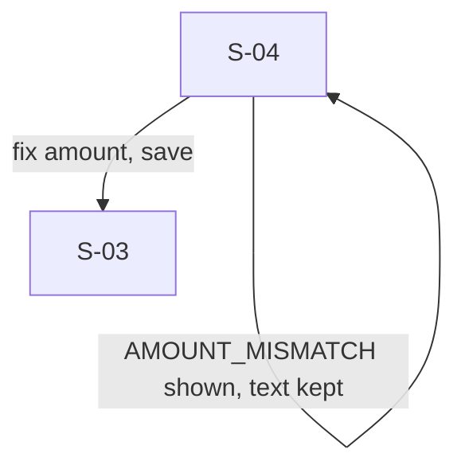
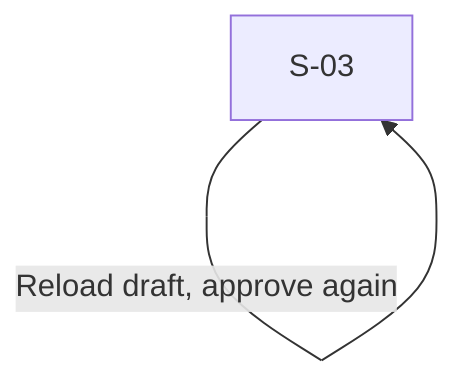
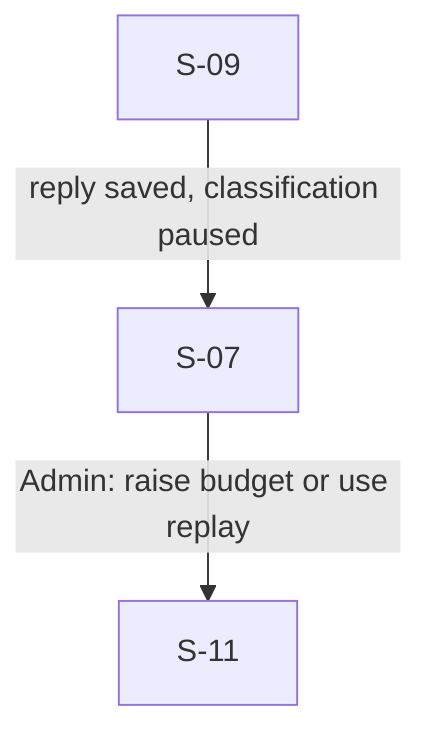

# UX flows: collections console (v1)

- Task: HACK-001
- Goal: a collector starts the day, sees who needs attention and why, approves verified reminders, records replies, and watches promises, payments and disputes resolve on one timeline.
- Stories: US-00-001 to US-00-026, US-01-001 to US-01-016, US-03-001, US-03-004 (docs/product/backlog.md)
- Sources: docs/product/user-flows.md (F1 to F13), docs/design/collections-lld.md, api/openapi.yaml, docs/reviews/design-plan-review.md
- Platform: desktop web, 1280 px and up, usable to 768 px (design plan review pass 6)

## 0. Spec against code

No application code exists yet (greenfield). The ledger below is read from the contract that code will be built to: `api/openapi.yaml` and the LLD error table (section 6). Each rejection becomes an error cell in section 2.

| Action | Endpoint | Rejections the contract defines | Who is calling |
| --- | --- | --- | --- |
| Sign in | POST /auth/sessions | UNAUTHORIZED (wrong email or password, one message for both), RATE_LIMITED (6th failure in a minute) | signed out |
| Approve | POST /messages/{id}/approve | STALE_DRAFT (409, another tab changed it), NOT_VERIFIED, FORBIDDEN (viewer), NOT_FOUND | collector or admin |
| Edit | PATCH /messages/{id} | guardrail codes (422) with the offending token, STALE_DRAFT | collector or admin |
| Reject | POST /messages/{id}/reject | REASON_REQUIRED | collector or admin |
| Simulate reply | POST /replies | MESSAGE_CUSTOMER_MISMATCH, VALIDATION_ERROR (empty or over 5,000 characters), BUDGET_EXHAUSTED or LLM_UPSTREAM (reply stored, classification pending, escalated) | collector or admin |
| Run now | POST /runs | 409 when today's run already exists (returns it) | admin |
| Advance clock | POST /admin/clock/advance | 422 outside 1 to 60 days | admin |
| Simulate credit | POST /admin/simulate/bank-credit | 422 amount 0 | admin |
| Reset | POST /admin/reset | none beyond auth | admin |
| Kill switch | PATCH /admin/settings | none beyond auth | admin |

Numbers the user sees for the ABC story on 30 Sep 2026: outstanding ₹7,50,000 over INV-1021 ₹4,00,000 (due 11 Sep, 19 days), INV-1034 ₹2,00,000 (due 18 Sep, 12 days), INV-1047 ₹1,50,000 (due 25 Sep, 5 days); priority 66, HIGH (LLD 3.2); tone firm. After the ₹3,00,000 credit on 05 Oct: INV-1021 remaining ₹1,00,000, outstanding ₹4,50,000.

Spec conflicts: none open (priority bands revised in Q-002; reset keeps LLM spend, AC-US-01-005-1).

## 1. Screen inventory

| Id | Screen | Purpose (one sentence) | Serves | Entry from | Exits to | Status |
| --- | --- | --- | --- | --- | --- | --- |
| S-01 | Sign in | Get into the console with a role. | US-01-007 | any route when signed out | S-02 | new |
| S-02 | Today | See what needs attention, totals, ageing and today's promises. | US-00-003, US-00-021, US-00-020 | S-01, rail | S-03, S-06, S-07, S-11 | new |
| S-03 | Approvals | Review each draft with its guardrail report, then approve, edit or reject. | US-00-009, US-00-010, US-01-016 | rail, S-02 | S-04, S-05, S-07, S-08, back | new |
| S-04 (dialog) | Edit draft | Change the wording; guardrails re-run on save. | US-00-010 | S-03 | cancel, save to S-03 | new |
| S-05 (dialog) | Reject draft | Reject with a reason. | US-00-009 | S-03 | cancel, confirm to S-03 | new |
| S-06 | Customers | Scan every customer with outstanding, band, last contact and next action. | US-00-026, US-00-002 | rail, S-02 | S-07 | new |
| S-07 | Customer | One customer's full picture, timeline and next action. | US-00-001, US-00-004, US-00-022, US-00-016 | S-02, S-03, S-06 | S-08, S-09, S-10, S-15, back | new |
| S-08 (dialog) | Agent run | The trajectory of one run: steps, redacted arguments, outcome. | US-00-008 | S-03, S-07 | close | new |
| S-09 (dialog) | Simulate reply | Record the customer's reply to a sent message. | US-03-001, US-00-012 | S-07 | cancel, submit to S-07 | new |
| S-10 (dialog) | Resolve dispute | Close a dispute with a note; reminders resume. | US-00-016 | S-07 | cancel, confirm to S-07 | new |
| S-11 | Admin | Sending, autonomy, clock, reset, demo tools, spend, runs, guardrail failures. | US-01-002, US-01-004, US-01-005, US-01-006, US-01-001 | rail (admin) | S-12, S-13, S-14, S-02 | new |
| S-12 (dialog) | Simulate bank credit | Post a signed credit for a customer. | US-00-017 | S-11 | cancel, post to S-11 | new |
| S-13 (dialog) | Reset demo | Confirm resetting data to the start of the ABC story. | US-01-005 | S-11 | cancel, confirm to S-02 | new |
| S-14 (dialog) | Advance clock | Move the demo date forward by N days. | US-01-004 | S-11 | cancel, confirm to S-11 | new |
| S-15 | Prepare call | Call sheet for one customer (flag). | US-00-025 | S-07 | back to S-07 | new |
| S-16 | Evaluation | Latest eval numbers and per-reply results. | US-01-010, US-01-011, US-01-012 | rail | S-02 | new |
| S-17 | Payment link (public) | Customer pays one invoice through a SIMULATED link (flag). | US-03-004 | emailed link | terminal: the customer's journey ends at the confirmation | new |

Stories with no screen: none visible to a user are left out; US-01-008, US-01-009, US-01-013, US-01-014, US-01-015, US-03-002, US-03-003 are backend, terminal or README work and surface only as numbers on S-11 and S-16.

## 2. Interaction states

### S-01 Sign in

| State | The user sees | Copy |
| --- | --- | --- |
| loading | button shows a spinner and is disabled; fields stay filled | "Signing in" |
| empty | email and password fields, demo accounts listed under the form | "Sign in to Collections" / "Sign in" |
| error | message above the form, password cleared, focus on password | "That email and password do not match. Try again, or use a demo account below." / on 429: "Too many attempts. Wait a minute, then try again." |
| success | redirect to Today (S-02) | none |
| offline | n/a: local demo; covered by the generic error "Cannot reach the server. Check that the stack is running (make up)." | |

### S-02 Today

| State | The user sees | Copy |
| --- | --- | --- |
| loading | skeleton tiles and list rows; rail usable | none |
| empty | totals at ₹0 and one invitation | "Nothing needs you today. Run the daily collection to prepare reminders." / "Run now" (admin) |
| error | each panel fails on its own with a retry; others stay | "Could not load promises. Retry" |
| success | attention list first (high priority, missed promises, disputes, approved and ready, needs verification), then totals and ageing, then today's promises with Check payment | "3 need attention" |
| partial | panels that loaded show; failed ones show their retry | "Some panels did not load. Retry" |
| offline | n/a: local demo; the per-panel error covers it | |

### S-03 Approvals

| State | The user sees | Copy |
| --- | --- | --- |
| loading | queue skeleton left, empty detail right | none |
| empty | a single line and a link | "No drafts waiting. The next daily run prepares new ones." / "Go to Today" |
| error | detail shows the code and the offending token next to the text; queue stays | "Approve failed: this draft changed in another tab. Reload the draft." (STALE_DRAFT) |
| success | toast, item leaves the queue, focus moves to the next draft | "Approved. Sending shortly." |
| partial | queue loaded, one draft's report failed | "Guardrail report did not load. Retry" and Approve disabled until it loads |
| offline | n/a: local demo | |

### S-04 Edit draft

| State | The user sees | Copy |
| --- | --- | --- |
| loading | Save shows a spinner while guardrails run | "Checking against the ledger" |
| empty | n/a: opens with the current text; an emptied body is a validation error | |
| error | the failing token highlighted in the text with the reason under it; text is kept | "₹4,50,000 does not match the ledger amount for INV-1021 (₹4,00,000). Fix the amount or cancel." |
| success | dialog closes, report shows all ticks, Approve enabled | "Saved and verified" |
| offline | n/a: local demo | |

### S-05 Reject draft

| State | The user sees | Copy |
| --- | --- | --- |
| loading | Reject button spinner | "Rejecting" |
| empty | reason field with suggestions (wrong tone, wrong timing, customer contacted by phone) | "Why reject this draft?" |
| error | inline under the field | "Add a reason so the next run can learn from it." |
| success | dialog closes, draft leaves the queue | "Rejected" |
| offline | n/a: local demo | |

### S-06 Customers

| State | The user sees | Copy |
| --- | --- | --- |
| loading | table skeleton | none |
| empty | n/a: seeded data always has customers; after a failed seed the error state applies | |
| error | table replaced by message and retry | "Could not load customers. Retry" |
| success | sortable table: name, outstanding, overdue, band, last contact, next action | "50 customers" |
| partial | first page shown, next page failed | "Showing 25 of 50. Load more" |
| offline | n/a: local demo | |

### S-07 Customer

| State | The user sees | Copy |
| --- | --- | --- |
| loading | header skeleton, then sections as they arrive | none |
| empty | new sections empty with their action (no messages yet, no promises) | "No messages yet. The next daily run drafts one if this customer is selected." |
| error | 404 page for an unknown id; section errors with retry | "Customer not found. Back to Customers" |
| success | header (outstanding, band, next action), invoices, priority reasons, timeline, tabs for messages, promises, disputes, payments, runs | none |
| partial | timeline loaded, runs failed | "Runs did not load. Retry" |
| offline | n/a: local demo | |

### S-08 Agent run

| State | The user sees | Copy |
| --- | --- | --- |
| loading | step skeletons | none |
| empty | a run with no tool calls (NO_ACTION) | "The agent made no tool calls: nothing to do for this customer today." |
| error | message and close | "Could not load this run. Close and try again." |
| success | numbered steps with role, tool, redacted arguments, result, and the outcome badge | "WAIT_FOR_APPROVAL" |
| offline | n/a: local demo | |

### S-09 Simulate reply

| State | The user sees | Copy |
| --- | --- | --- |
| loading | Submit spinner while classification runs | "Reading the reply" |
| empty | pick the sent message, paste the reply; sample replies offered | "Paste the customer's reply" |
| error | inline; the reply is kept | "The reply is empty or longer than 5,000 characters. Shorten it and submit." / on BUDGET_EXHAUSTED: "Reply saved. Classification paused: LLM budget spent. An admin can raise it in Admin." |
| success | dialog closes, timeline shows the reply and its class, amount and date | "Recorded: PROMISE ₹3,00,000 on 05 Oct 2026" |
| offline | n/a: local demo | |

### S-10 Resolve dispute

| State | The user sees | Copy |
| --- | --- | --- |
| loading | Confirm spinner | "Resolving" |
| empty | note field | "How was this resolved?" |
| error | inline | "Add a note so the timeline explains the outcome." |
| success | dialog closes, invoice status returns by balance, timeline entry | "Dispute resolved. Reminders resume for INV-1047." |
| offline | n/a: local demo | |

### S-11 Admin

| State | The user sees | Copy |
| --- | --- | --- |
| loading | skeletons per card | none |
| empty | no runs yet, no guardrail failures | "No runs yet today. Run now" |
| error | per-card error with retry; a non-admin sees 403 | "Admins only. Back to Today" |
| success | Sending on/off switch, autonomy mode, demo date with Advance, Reset, Simulate credit, Run now, LLM spend bar, last 20 runs, last 20 guardrail failures, feature flags | "Sending is on" / "Sending is paused" |
| partial | settings loaded, runs failed | "Runs did not load. Retry" |
| offline | n/a: local demo | |

### S-12 Simulate bank credit

| State | The user sees | Copy |
| --- | --- | --- |
| loading | Post spinner | "Posting credit" |
| empty | customer picker, amount in rupees, reference | "Simulate a bank credit" |
| error | inline | "Enter an amount above ₹0." |
| success | dialog closes, toast with match result | "Credit ₹3,00,000 matched to ABC Distributors" or "Credit needs verification: 2 possible customers" |
| offline | n/a: local demo | |

### S-13 Reset demo

| State | The user sees | Copy |
| --- | --- | --- |
| loading | Confirm spinner | "Resetting" |
| empty | n/a: a confirmation with no fields | |
| error | inline | "Reset failed. Check the api logs, then try again." |
| success | redirect to Today at 30 Sep 2026 | "Demo reset to 30 Sep 2026. LLM spend was kept." |
| offline | n/a: local demo | |

### S-14 Advance clock

| State | The user sees | Copy |
| --- | --- | --- |
| loading | Confirm spinner | "Advancing" |
| empty | days field, default 5, preview of the new date | "Advance to 05 Oct 2026" |
| error | inline | "Choose between 1 and 60 days." |
| success | dialog closes, date updated everywhere, promise check result | "Demo date is 05 Oct 2026. 0 promises missed." |
| offline | n/a: local demo | |

### S-15 Prepare call

| State | The user sees | Copy |
| --- | --- | --- |
| loading | skeleton | none |
| empty | n/a: opens only for a customer with open invoices | |
| error | message and back; flag off shows a pointer | "Prepare call is switched off. An admin can turn it on in Admin." |
| success | summary, invoices, prior promises, talking points | none |
| offline | n/a: local demo | |

### S-16 Evaluation

| State | The user sees | Copy |
| --- | --- | --- |
| loading | skeleton | none |
| empty | no report yet | "No evaluation has run yet. Run make eval, then refresh." |
| error | message | "Could not load the report. Retry" |
| success | four reply metrics as n/40, scenarios passed, red-team rejected n/n, golden passed, the command and mode, per-reply table | "Replay mode, generated 30 Sep 2026" |
| partial | metrics loaded, per-reply table failed | "Details did not load. Retry" |
| offline | n/a: local demo | |

### S-17 Payment link (public)

| State | The user sees | Copy |
| --- | --- | --- |
| loading | skeleton | none |
| empty | n/a: a link always names an invoice | |
| error | invalid, expired or already paid | "This payment link is not valid or has already been used." |
| success | SIMULATED banner, receipt | "SIMULATED payment of ₹2,00,000 for INV-1034 recorded." |
| offline | n/a: local demo | |

## 3. Journey storyboard

Goal: finish the ABC story in under ten minutes without doubting a single number.

| Step | The user does | Sees | Feels | The design does |
| --- | --- | --- | --- | --- |
| 1 | opens Today | ABC at the top of high priority with three reasons | "why this one?" | reasons in plain words with amounts |
| 2 | opens Approvals | ABC's firm draft, every invoice ticked "matches ledger" | cautious | the report sits beside the text, not hidden |
| 3 | tries a wrong amount in Edit | the token is highlighted and refused | reassured | exact reason and the ledger value |
| 4 | approves | toast, next draft focused | quick | keyboard A, focus moves on |
| 5 | checks Mailpit, simulates the reply | PROMISE ₹3,00,000 on 05 Oct on the timeline | relief | class, amount, date in one line |
| 6 | advances the clock, posts the credit | promise fulfilled, outstanding ₹4,50,000 | satisfaction | timeline highlights the fulfilment |
| 7 | simulates the dispute | escalation, INV-1047 marked disputed | control | disputed invoice leaves future drafts |

Five-second read of Today: who needs me and why. Five-minute read: the ABC timeline from reminder to fulfilled promise to dispute.

## 4. Navigation map

## 5. Flows

### Happy path

### Alternate: edit before approving

### Alternate: dispute and resolve

### Error recovery: wrong amount in an edit

### Error recovery: stale draft on approve

### Error recovery: LLM budget spent while recording a reply

## 6. Decision points and dead-end check

| Branch | Condition | One side | Other side |
| --- | --- | --- | --- |
| queue action | approve, edit or reject | S-03 (approved) | S-04 or S-05 |
| reply class | PROMISE, DISPUTE, other | S-07 promise row | S-07 escalation row |
| credit match | unique or ambiguous | S-11 matched toast | S-02 needs-verification item |
| role | admin or not | S-11 | S-02 (rail hides Admin) |

Every screen has a way forward and a way back (navigation map); S-17 is terminal. Dead ends: 0 (gate).

## 7. Interaction inventory

| Screen | Control | Type | Target | Keyboard | Event |
| --- | --- | --- | --- | --- | --- |
| S-01 | Sign in | button | 44 px | Enter | no sheet |
| S-02 | attention item | link row | 44 px | Tab, Enter | no sheet |
| S-02 | Check payment | button | 32 px pointer | Tab, Enter | no sheet |
| S-03 | Approve / Edit / Reject | buttons | 36 px | A / E / R, J and K move | no sheet |
| S-04 | Save and verify | button | 36 px | Ctrl+Enter | no sheet |
| S-07 | Simulate reply, Resolve, Prepare call, View run | buttons | 36 px | Tab, Enter | no sheet |
| S-11 | Sending switch, Autonomy select, Advance, Reset, Simulate credit, Run now | switch, select, buttons | 36 px | Tab, Space, Enter | no sheet |
| S-16 | per-reply filter | select | 36 px | Tab | no sheet |

Analytics: none planned (HLD section 11), so every row reads `no sheet`.

## 8. Open questions

| Question | Owner (role) | Date | Ships if deferred |
| --- | --- | --- | --- |
| Should viewers see message bodies? | product owner | before P1 | viewers see bodies (read-only) |
| Should Today auto-refresh during the demo? | product owner | before demo | 10 s refetch on Approvals and Admin only |

## 9. Self-review

F1 goal stated: yes. F2 dead ends: from the gate. F3 every story mapped: yes (non-UI stories named). F4 state coverage: from the gate. F5 copy has verbs and next steps: yes. F6 numbers computed for the scenario: yes (section 0).
